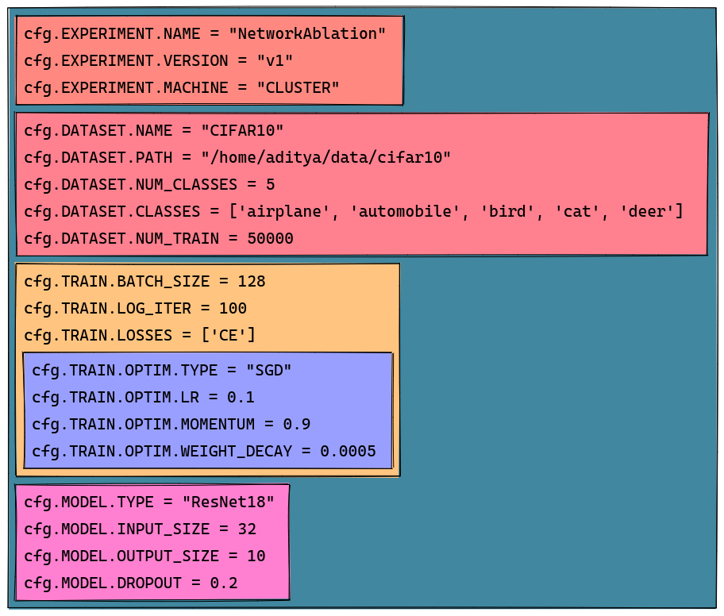
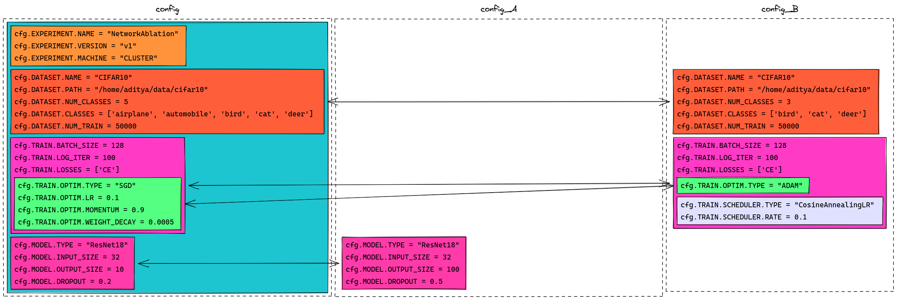
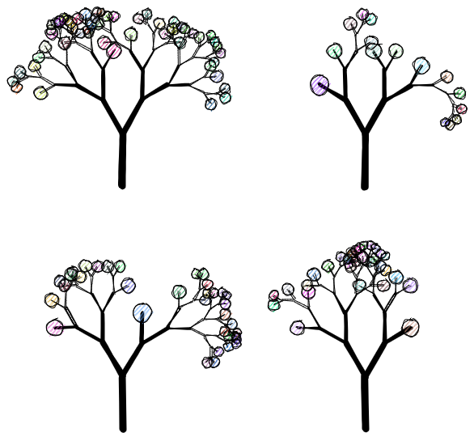
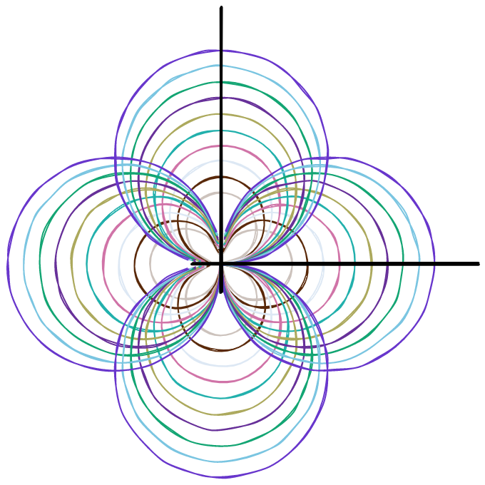
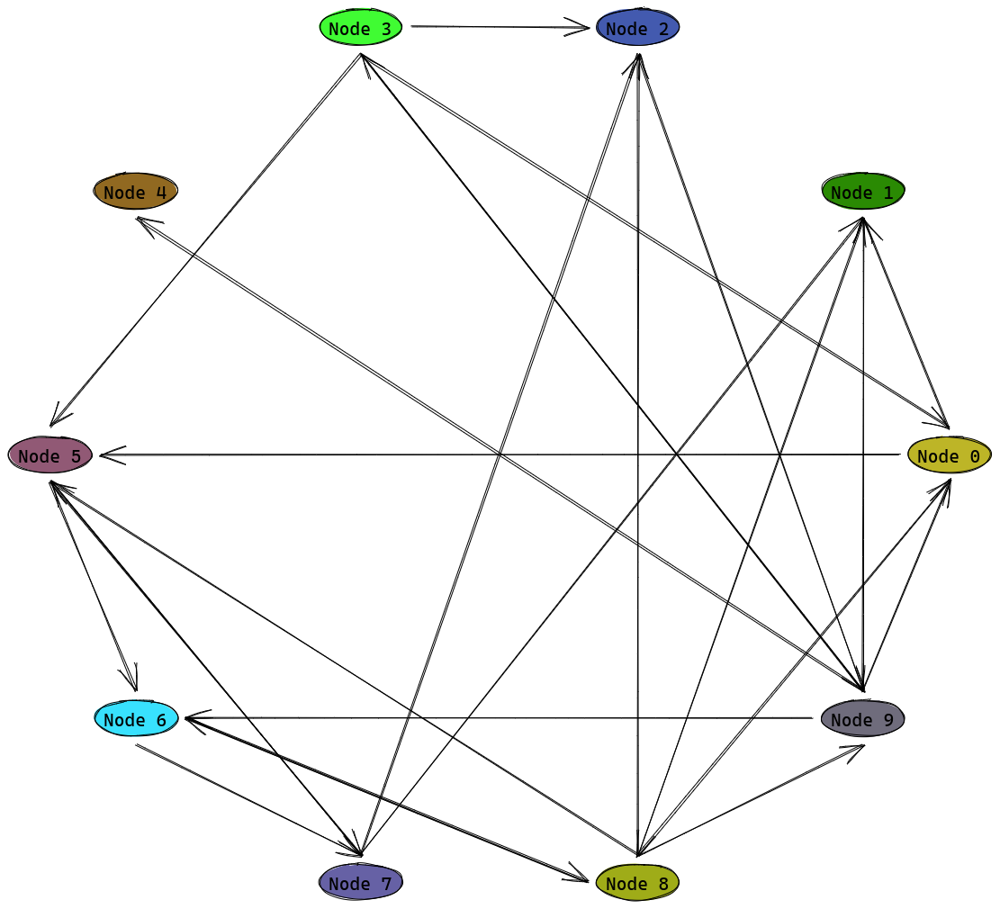

# ProcXD

A tool for making excalidraw figures procedurally from python. Its very easy to visualize excalidraw files either from web (just load the file at [excalidraw.com](https://excalidraw.com/)) or with a vs-code [plugin](https://marketplace.visualstudio.com/items?itemName=pomdtr.excalidraw-editor) (simply open a `.excalidraw` file in vscode).

## Usecases

### Visualizing large configurations

If you have large configurations, it might be useful to visualize the configuration tree. Helpful for debugging and to confirm variations between different ablations. Detailed example in `examples/config_vis.py`.

We can visualize configuration ([YACS](https://github.com/rbgirshick/yacs) objects) as below using `SketchBuilder.render_stack_sketch`.

Alternatively, we can also compare different configurations with `SketchBuilder.render_comparitive_stack_sketch`

### Procedural graph objects

You may want to create a excalidraw graph procedurally for precision. Some examples in `examples/proc_figures.py`.

#### Create Trees

#### Create Graphs

### NetworkX graph visualization

It might also be useful for converting arbitrary graphs from networkx to excalidraw figures. The benefits are two-folds: SVG format helps manage resolution, and the arrows are bounded between elements which means you can move the graph around!

## Todo

1) Support Images

## What ProcXD does not support

1) Versioning
2) *Exact* text bounding box size - as a result the text bounding box sizes are adjusted in the file with the file is opened with excalidraw.

## Acknowledgements

I used ChatGPT while creating this tool. It was helpful in many ways, but also misleading at times. Overall, it is helpful (don't know if its 10x though)!
